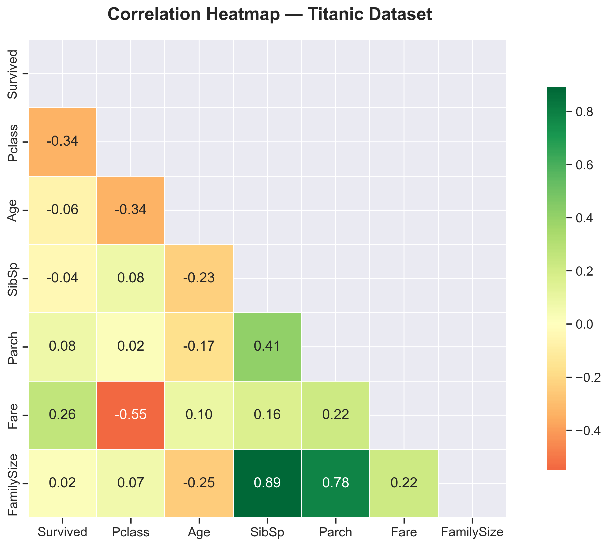
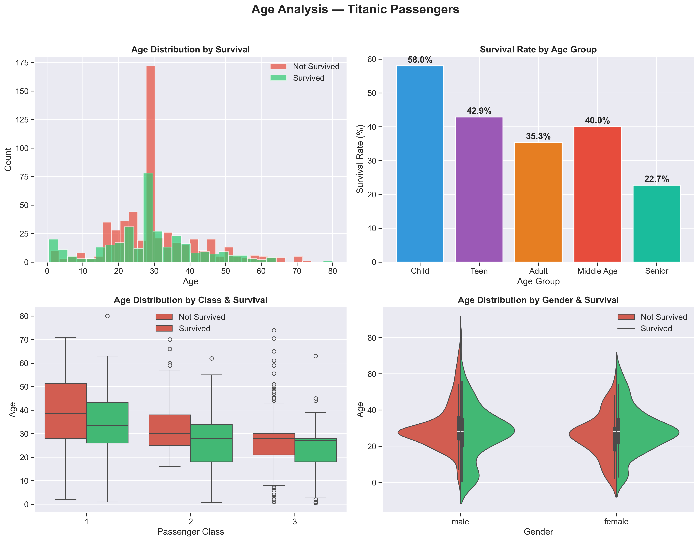
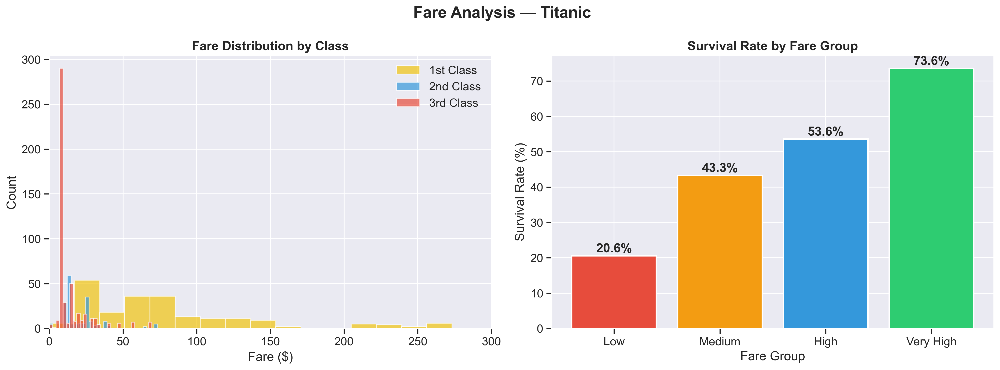
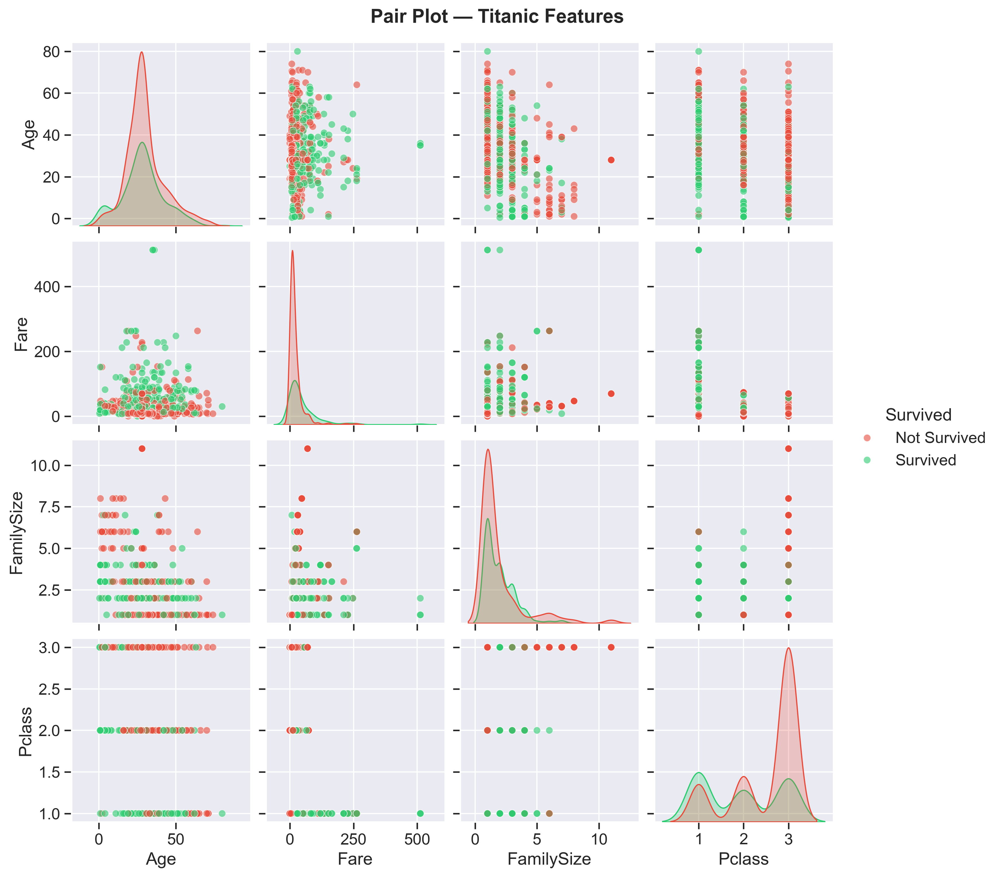
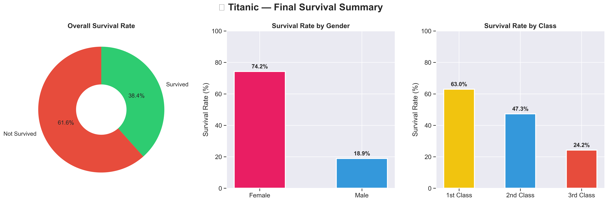

# 📊 Titanic - Advanced Data Visualization

##  Overview

This project focuses on **Advanced Data Visualization** of the Titanic dataset. While Exploratory Data Analysis (EDA) helps us understand data, **Data Visualization** helps us tell a compelling story through beautiful and interactive charts. This project transforms raw Titanic data into professional, meaningful, and interactive visual insights using Python's most powerful visualization libraries.


##  Objectives

- ✅ Transform raw Titanic data into meaningful visual stories
- ✅ Build both static and interactive charts
- ✅ Analyze survival patterns through advanced visualizations
- ✅ Create a complete interactive dashboard
- ✅ Build a strong data visualization portfolio


## 📁 Project Structure
CodeAlpha_DataVisualization/
│
├── 📁 data/
│   └── titanic.csv                       # Raw Titanic dataset
│
├── 📁 notebooks/
│   └── titanic_visualization.ipynb       # Complete visualization notebook
│
├── 📁 images/
│   ├── correlation_heatmap.png           # Correlation heatmap
│   ├── age_analysis_advanced.png         # Age analysis (4 charts)
│   ├── fare_analysis.png                 # Fare analysis charts
│   ├── pair_plot.png                     # Pair plot
│   └── final_summary.png                # Final summary charts
│
├── 📁 dashboard/
│   ├── survival_by_class_gender.html     # Interactive bar chart
│   ├── sunburst_survival.html            # Interactive sunburst chart
│   └── complete_dashboard.html           # Complete interactive dashboard
│
├── 📄 README.md                          # Project documentation
├── 📄 .gitignore                         # Git ignore rules

---

##  Tools & Libraries Used

| Tool/Library | Purpose |
|-------------|---------|
| Python 3.x | Core programming language |
| Pandas | Data manipulation & preparation |
| NumPy | Numerical computations |
| Matplotlib | Static chart creation |
| Seaborn | Advanced statistical visualizations |
| Plotly | Interactive charts & dashboards |
| Jupyter Notebook | Interactive coding environment |


##  Visualizations & Explanations

### 1️⃣ Correlation Heatmap


**What it shows:**
This heatmap displays the **statistical relationship** between every numerical variable in the dataset.

**How to read it:**
- 🟢 **Green** → Positive relationship (both variables increase together)
- 🔴 **Red** → Negative relationship (one increases, other decreases)
- ⚪ **White** → No relationship between variables

**Key Insights:**
- `Pclass` and `Survived` have a **negative correlation (-0.34)** — higher class number (3rd class) means lower survival
- `Fare` and `Survived` have a **positive correlation (+0.26)** — passengers who paid more had better survival chances
- `Age` has a **slight negative correlation** with survival — older passengers survived less

---

### 2️⃣ Interactive Survival Chart by Class & Gender
> 📂 File: `dashboard/survival_by_class_gender.html`

**What it shows:**
An **interactive grouped bar chart** comparing survival rates of male and female passengers across all three passenger classes.

**Key Insights:**
-  **1st Class Female** → Highest survival rate (~97%)
-  **3rd Class Male** → Lowest survival rate (~15%)
- In **every class**, female survival rate was significantly higher than male
- Clear evidence of **"Women and Children First"** evacuation policy

---

### 3️⃣ Advanced Age Analysis


**What it shows:**
Four different charts analyzing how **age influenced survival** on the Titanic.

**Chart 1 — Age Distribution Histogram:**
- 🟢 Green bars → Ages of passengers who survived
- 🔴 Red bars → Ages of passengers who did not survive
- Most deaths occurred in the **20-40 age group**

**Chart 2 — Age Group Survival Rate:**
-  **Children** had the highest survival rate (~58%)
-  **Seniors** had the lowest survival rate
- Children were prioritized during evacuation

**Chart 3 — Box Plot (Class & Age):**
-  Box shows the middle 50% of passenger ages
-  Line inside box shows the median age
- ⚫ Dots outside show unusual/extreme ages (outliers)

**Chart 4 — Violin Plot (Gender & Age):**
-  Wider section means more passengers at that age
- Female survival was consistently better across all age groups

---

### 4️⃣ Interactive Sunburst Chart
> 📂 File: `dashboard/sunburst_survival.html`

**What it shows:**
A beautiful **interactive sunburst chart** showing survival breakdown across three levels simultaneously — Survival Status → Passenger Class → Gender.

**How to read it:**
-  **Center ring** → Overall Survived vs Not Survived
- 🔵 **Middle ring** → Breakdown by passenger class (1st, 2nd, 3rd)
- 🟢 **Outer ring** → Further breakdown by gender
- Bigger slice = More passengers in that category

**Key Insight:**
- You can clearly see that **1st Class Females** had the largest green slice
- **3rd Class Males** had the largest red slice

---

### 5️⃣ Fare Analysis


**What it shows:**
How the **ticket fare** passengers paid was related to their class and survival.

**Chart 1 — Fare Distribution by Class:**
- 🟡 **1st Class** → Very expensive tickets ($100-$500)
- 🔵 **2nd Class** → Medium priced tickets ($10-$50)
- 🔴 **3rd Class** → Cheap tickets ($5-$20)

**Chart 2 — Survival Rate by Fare Group:**
-  **Very High fare** → ~65% survival rate
-  **Low fare** → ~20% survival rate
- Clear pattern: **More money paid = Higher survival chance**

---

### 6️⃣ Complete Interactive Dashboard
> 📂 File: `dashboard/complete_dashboard.html`

**What it shows:**
A **professional interactive dashboard** with 4 charts in one place giving a complete picture of Titanic survival analysis.

| Position | Chart | Description |
|----------|-------|-------------|
| Top Left | Bar Chart | Survival rate by gender |
| Top Right | Donut Chart | Overall survival percentage |
| Bottom Left | Bar Chart | Family size vs survival rate |
| Bottom Right | Scatter Plot | Age vs Fare colored by survival |

**Scatter Plot Guide:**
- 🟢 Green dots → Passengers who survived
- 🔴 Red dots → Passengers who did not survive
- Dots at top → Expensive tickets = Higher survival
- Dots at bottom → Cheap tickets = Lower survival

---

### 7️⃣ Pair Plot


**What it shows:**
Relationship between **every variable** with **every other variable** in one single chart.

**How to read it:**
-  **Diagonal boxes** → Distribution curve (KDE) of one variable
-  **Other boxes** → Scatter plot between two variables
- 🟢 **Green points** → Survived passengers
- 🔴 **Red points** → Not survived passengers

**Key Insight:**
- High Fare + Low Pclass number (1st Class) = More green dots (survived)
- Low Fare + High Pclass number (3rd Class) = More red dots (not survived)

---

### 8️⃣ Final Summary Visualization


**What it shows:**
Three clean professional charts summarizing the most important findings.

**Chart 1 — Overall Survival Donut:**
- 🔴 **61.6%** → Did NOT survive (549 passengers)
- 🟢 **38.4%** → Survived (342 passengers)

**Chart 2 — Survival by Gender:**
-  **Female → 74.2%** survived
-  **Male → 18.9%** survived
- "Women First" policy clearly visible

**Chart 3 — Survival by Class:**
-  **1st Class → 62.9%** survived
-  **2nd Class → 47.3%** survived
-  **3rd Class → 24.2%** survived

---

##  Key Conclusions

1. **Gender** was the strongest factor — females had ~4x higher survival rate than males
2. **Passenger Class** directly impacted survival — wealthier passengers had better lifeboat access
3. **Fare paid** strongly correlated with survival — higher fare = better survival chances
4. **Children** were prioritized during evacuation across all classes
5. **Family size** of 2-4 members had better survival than solo travelers or large families

---

##  How to Run

**Step 1:** Clone this repository
```bash
git clone https://github.com/Raffia-T17/CodeAlpha_DataVisualization.git
```

**Step 2:** Navigate to project folder
```bash
cd CodeAlpha_DataVisualization
```

**Step 3:** Install required libraries
```bash
pip install -r requirements.txt
```

**Step 4:** Open Jupyter Notebook
```bash
jupyter notebook
```

**Step 5:** Open and run `notebooks/titanic_visualization.ipynb`

**Step 6:** For interactive charts open `dashboard/` HTML files in browser

---

##  Author

**Raffia Pervaiz**
CodeAlpha Data Analytics Internship

[](https://github.com/Raffia-T17)
[](https://www.linkedin.com/in/raffia-parvaiz-880268349)

---

> ⭐ If you found this project helpful, please give it a star!
>
> 📧 Feel free to connect on LinkedIn for any questions or feedback!